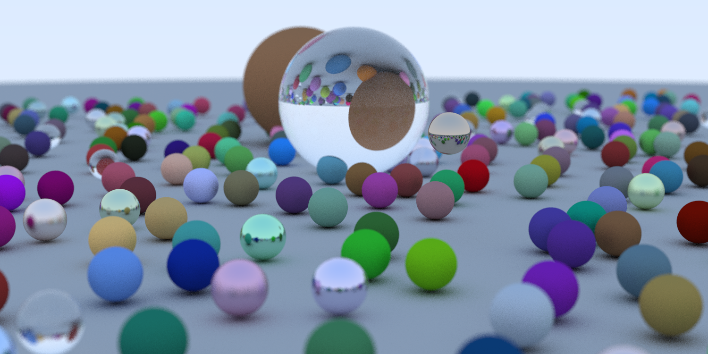

# ray tracing in a weekend

following [this guide](https://raytracing.github.io/books/RayTracingInOneWeekend.html) but in Rust to level up

### Progress:

#### Pending further improvements
- [ ] Multi threading
- [ ] Motion blur
- [ ] Textures
- [ ] Boxes
