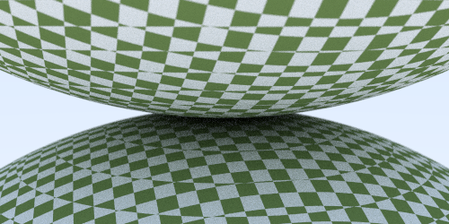
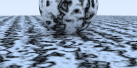
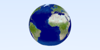

# ray tracing in a weekend

following [this guide](https://raytracing.github.io/) but in Rust to level up

### Progress:

### Other samples

|  |  |
|------------------------------------------------------------|-------------------------------------------|

#### Pending further improvements
- [ ] Multi threading
- [x] Motion blur
- [x] Textures
- [ ] Boxes
